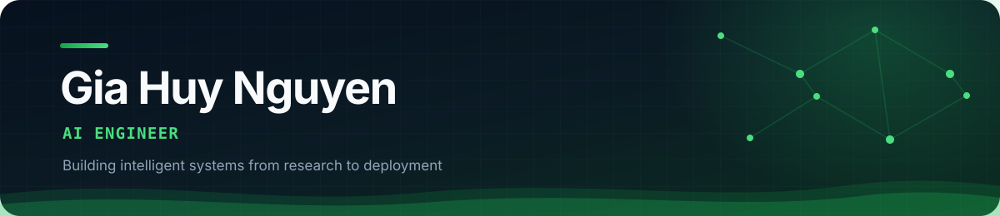

## Hello, I'm Huy 👋

I'm a final-year Information Technology student in Ho Chi Minh City, focused on building end-to-end AI products. I enjoy turning research ideas into reliable systems - from model and retrieval experiments to APIs, evaluation pipelines, and user-facing applications.

- 🔭 Building with **Computer Vision, RAG, and agentic AI**
- 🧪 Interested in **evaluation, retrieval quality, and trustworthy AI systems**
- 🧠 Researching generative models and training stability
- 🌱 Currently deepening my skills in production AI engineering
- 💬 Open to conversations about AI engineering, computer vision, and LLM applications

## Tech stack

**AI & Computer Vision**

**LLMs & Agentic AI**

**Product Engineering**

## Featured work

| Project | What it does | Core stack |
| :-- | :-- | :-- |
| [**Evidence-First Job Application Agent**](https://github.com/huystackai/cv-tool) | Discovers and scores roles, tailors evidence-constrained CVs, and prepares auditable applications with safe-by-default automation. | Python, OpenAI API, SQLite, Playwright |
| [**Real-Time Face Recognition**](https://github.com/huystackai/FaceMask) | Recognizes faces from webcam frames using MTCNN and FaceNet; includes dataset embedding, static-image tests, and a browser demo. | PyTorch, OpenCV, MTCNN, FaceNet |
| [**Insight with RAG**](https://github.com/huystackai/Insight-with-RAG-) | Full-stack insight platform with vector retrieval, persistence, evaluation metrics, and a Vietnamese dashboard. | FastAPI, Next.js, Qdrant, MongoDB |
| [**AI Co-Worker Engine**](https://github.com/huystackai/AI-CoWorker-Engine) | Multi-agent workplace simulation with orchestration, evolving session memory, supervisor logic, and persistence. | FastAPI, LangChain, MongoDB, LLMs |

## Research & milestones

- 📄 Main author of **“SPD-GAN: Difficulty Adjustment for Discriminators in Generative Models”**, presented at STAIS 2025
- 🥉 Bronze Medal, **12th Applied Manufacturing Design Competition** (2024)
- 🌏 **Google Student Ambassador** - Top 700 representatives nationwide (2026)
- 🎓 Information Technology, University of Transport Ho Chi Minh City - **GPA 3.4/4.0**, expected 2026

## GitHub overview

---

### Let's build something useful with AI

If you're working on applied AI, computer vision, retrieval, or agent systems, I'd be happy to connect.

